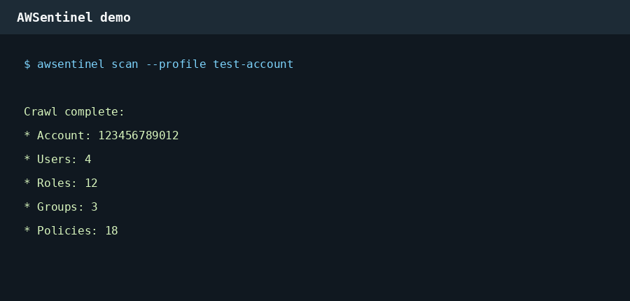

# AWSentinel

AWSentinel is an open-source AWS security analysis platform that crawls AWS accounts, builds IAM attack-path graphs, prioritizes risk, and routes remediation safely.



## CLI

Run an IAM crawl and persist raw resources to SQLite:

```bash
awsentinel scan --profile test-account --db-path ~/.awsentinel/db.sqlite
```

Render findings and full attack-path chains from a serialized AWSentinel payload:

```bash
awsentinel report --input report.json
awsentinel report --format json --input report.json
awsentinel report --format md --input report.json
awsentinel report --format graph --input report.json
```

The terminal report ranks findings by severity and risk score, uses colored severity output, and prints complete attack-path chains. The graph format emits D3-ready `{"nodes": [...], "links": [...]}` JSON for the v2 dashboard.

## Phase 4 Intelligence

Phase 4 adds operational intelligence on top of graph reachability:

- Risk classification with `risk_score`, severity, confidence, blast radius, and auto-remediation routing.
- Runtime correlation and CloudTrail Access Advisor service-last-accessed collection.
- Least-privilege analysis, stale-access detection, graph diffing, dependency fan-out, suppression handling, and prioritization.
- Remediation safety checks for Terraform/IaC-managed resources, exception tags, rollback feasibility, lockout risk, live workloads, active sessions, maintenance windows, production criticality, downstream fan-out, and recent use.

## Terraform

A scan-role manifest is available at `terraform/awsentinel_scan_role.tf`. It creates `AWSentinelScanRole` with a read-only crawler policy for IAM inventory, service-last-accessed details, Organizations SCP inventory, CloudTrail lookup, and STS identity validation.

## CI/CD

GitHub Actions runs linting and tests on every push and pull request to `main`. Tagged releases build the source distribution and wheel, then attach the artifacts to the GitHub Release.
